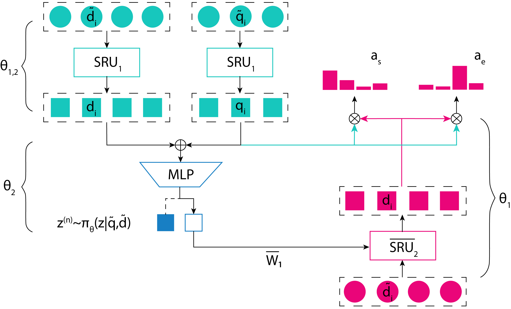
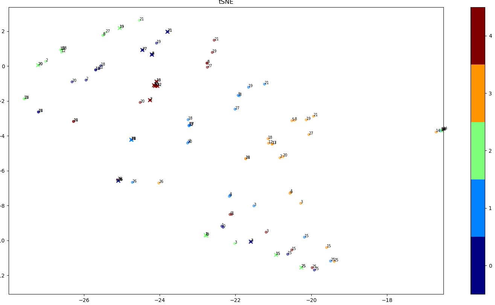

## APSN
Latent Question Interpretation Through Parameter Adaptation Using Stochastic Neuron 

In this work we propose a training framework and the APSN module for learning question interpretations that help
to find various valid answers within the same document. 
<p align="center">
<br>
<i><sub>Structure overview of integrated APSN module with DrQA. In this illustration number of interpretations is 2 and a sampled interpretation is 1.</sub></i><br>
</p>

|| <sub>Sample answers (`Model`) produced by inducing the value of a latent interpretation given `D, Q`</sub>|
| --- | --- |
| `D` | <sub>ITV Tyne Tees was based at City Road for over 40 years after its launch in January 1959.<br>In 2005 it moved to a new facility on The Watermark business park next to the MetroCentre in Gateshead.</sub>|
| `Q` | <sub>Where did ITV Tyne Tees move in 2005?</sub>|
| `A` | <sub>[’a new facility’]</sub> |
| `Model` | <sub>['The Watermark business park', 'Gateshead']</sub> |
|||
| `D` | <sub>Research shows that student motivation and attitudes towards school are closely linked to student-teacher<br> relationships. Enthusiastic teachers are particularly good at creating beneficial relations with their students.</sub>|
| `Q` | <sub>What type of relationships do enthusiastic teachers cause?</sub>|
| `A` | <sub>[’beneficial’]</sub> |
| `Model` | <sub>['student-teacher', 'beneficial relations']</sub> |
|||
| `D` | <sub>For Luther, also Christ’s life, when understood as an example, is nothing more than an illustration<br>of the Ten Commandments, which a Christian should follow in his or her vocations on a daily basis.</sub>|
| `Q` | <sub>What should a Christian follow in his life?</sub>|
| `A` | <sub>[’Ten Commandments’]</sub> |
| `Model` | <sub>['Ten Commandment', 'vocations on a daily basis']</sub> |
|||
| `D` | <sub>It is believed that the civilization was later devastated by the spread of diseases from Europe,<br>such as smallpox.</sub>|
| `Q` | <sub>What was believed to be the cause of devastation to the civilization?</sub>|
| `A` | <sub>[’spread of diseases from Europe’]</sub> |
| `Model` | <sub>['smallpox', 'spread of diseases from Europe']</sub> |

Tested on GeForce GTX Titan X.

## Setup
**GPU and CUDA 8 are required**

#### Install
 
 - Python >= 3.5 
 - [PyTorch](http://pytorch.org/)
 - CuPy, pynvrtc
 - Spacy 1.10.1
 - Cython, Pandas, NumPy, Scikit-learn
 - msgpack, tensorboardX, Matplotlib
 
 #### Download 
 
 - the [SQuAD](https://rajpurkar.github.io/SQuAD-explorer/)
 - GloVe word vectors 
 - [Sent2vec](https://github.com/epfml/sent2vec) with wiki_bigram.bin 
 - Use checkpoint [`init1`](https://drive.google.com/open?id=1pom0i15ztFmC9wie1odjizs_ER00yzzF) to initialize models for training
 
 using `bash download.sh`
 
 #### Preprocess Dataset
 ```bash
# prepare the data
python prepro.py

# prepare semi-supervised labels for question-answer pairs
python semisup_labels.py

# make sure CUDA lib path can be found, e.g.:
export LD_LIBRARY_PATH=/usr/local/cuda/lib64
```

## Running Code
 ```bash
# training in semi-supervised VAE framework
python train.py -e 240 -bs 50 -rd init1 -rs best_model.pt -lr  0.0005 --pi_q_rnn pi_d_nqd --control_d sru_00_kconv5_gram_s_cos --critic_loss --n_actions 5 --vae --semisup --rl_start 80 --rl_tuning pg

# sample answers with induced values for interpretations
python interpret.py -bs 32 -rd m1_80.9 -rs best_model.pt --pi_q_rnn pi_d_nqd --control_d sru_00_kconv5_gram_s_cos --n_actions 5 --vae

# visualize document encodings with interpretation-adapted parameters
python tsne.py -bs 1 -rd m1_80.9 -rs best_model.pt --pi_q_rnn pi_d_nqd --control_d sru_00_kconv5_gram_s_cos --n_actions 5 --vae
 ```
 <p align="center">
<br>
<i><sub>Indices represent different documents, colors correspond to induced interpretations (interpretation marked with cross was chosen by the policy during testing)</sub></i><br>
</p>

## Credits
Author of the Document Reader model: [@danqi](https://github.com/danqi)

Pytorch implementation of DrQA with SRU cells [@taolei87](https://github.com/taolei87/sru/tree/master/DrQA)
